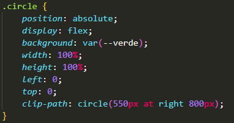
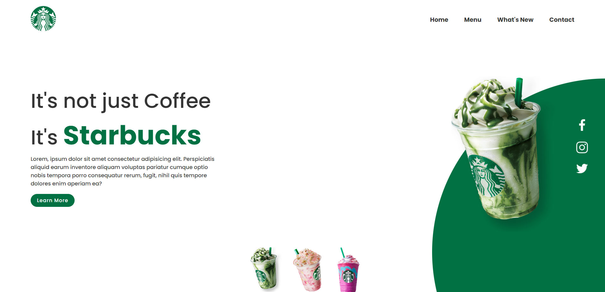
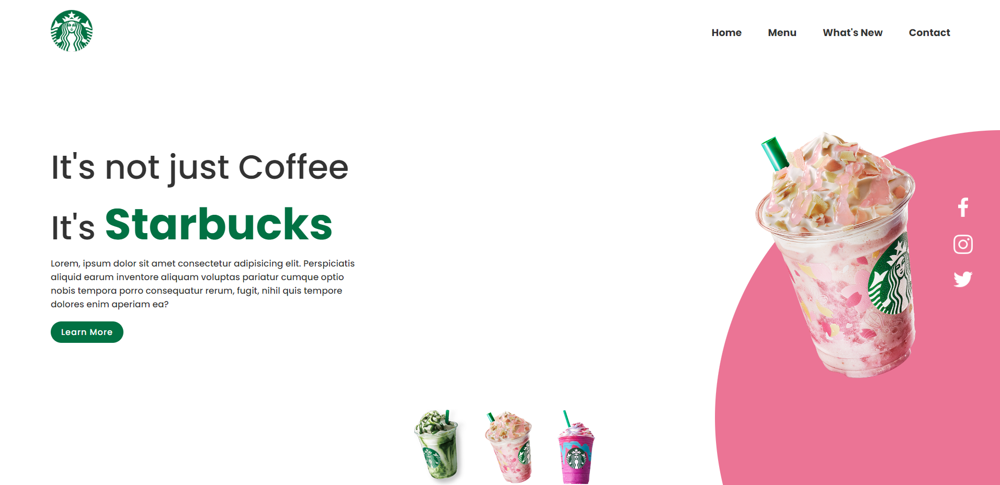
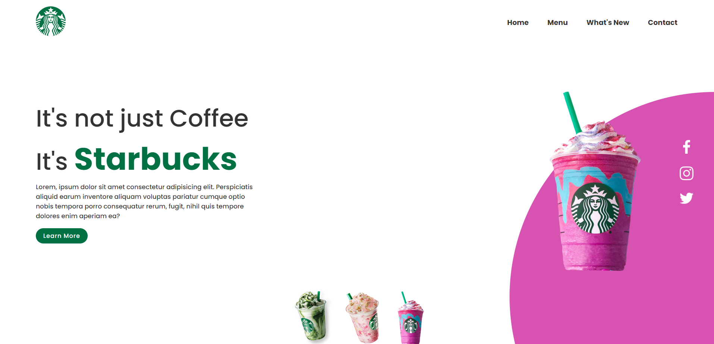

# :triangular_ruler: Landing-Page Starbucks

# :memo: Índice
* [:chart_with_upwards_trend: Proposta](https://github.com/rodrigobarros2802/landing-page-starbucks/edit/master/README.md#chart_with_upwards_trend-proposta)
* [:trophy: Desafio](https://github.com/rodrigobarros2802/landing-page-starbucks/edit/master/README.md#trophy-desafio)
* [:hammer_and_wrench: Tecnologias](https://github.com/rodrigobarros2802/landing-page-starbucks/edit/master/README.md#hammer_and_wrench-tecnologias)
* [:dart: Objetivo](https://github.com/rodrigobarros2802/landing-page-starbucks/edit/master/README.md#dart-objetivo)
* [:open_book: Aprendizado](https://github.com/rodrigobarros2802/landing-page-starbucks/edit/master/README.md#open_book-aprendizado)
* [:camera: Imagens do Projeto](https://github.com/rodrigobarros2802/landing-page-starbucks/edit/master/README.md#camera-imagens-do-projeto)
* [:link: Links](https://github.com/rodrigobarros2802/landing-page-starbucks/edit/master/README.md#link-links)
* [:technologist: Autor](https://github.com/rodrigobarros2802/landing-page-starbucks/edit/master/README.md#technologist-autor)

# :chart_with_upwards_trend: Proposta

# :trophy: Desafio

# :hammer_and_wrench: Tecnologias
* **JavaScript**
* **HTML5**
* **CSS3**

# :dart: Objetivo

# :open_book: Aprendizado
* Nesse projeto aprendi a aplicar o uso da propriedade **clip-path** onde pude adicionar esse background redondo no canto da tela, onde tentei aplicar em um projeto anterior e não conseguir.

# :camera: Imagens do Projeto

# :link: Links
* **Link GitHub Pages** - https://rodrigobarros2802.github.io/landing-page-starbucks/

# :technologist: Autor
* **Repositório** - https://github.com/rodrigobarros2802
* **LinkedIn** - https://www.linkedin.com/in/rodrigobarros2802/
